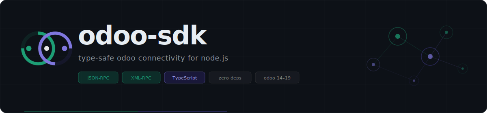

<!-- markdownlint-disable MD033 -->
<h1>
  
  <span style="vertical-align: middle;">odoo-sdk</span>
</h1>

<p align="center">
  
</p>

<p align="center">
  <a href="https://www.npmjs.com/package/odoo-sdk"></a>
  <a href="https://github.com/vvhybe/odoo-sdk/actions/workflows/ci.yml"></a>
  <a href="https://codecov.io/gh/vvhybe/odoo-sdk"></a>
  <a href="LICENSE"></a>
  
  
</p>

> Type-safe JSON-RPC and XML-RPC client for Odoo — works with Node.js, Next.js, React and any modern JS runtime.

<h2>
  
  <span style="vertical-align: middle;">Features</span>
</h2>

- **Dual protocol** — JSON-RPC (`/web/dataset/call_kw`) and XML-RPC (`/xmlrpc/2/object`) in one package
- **Full TypeScript** — typed domains, field values, ORM options, and error classes
- **Auth strategies** — session/password auth or API key (Odoo 14+)
- **Retry & timeout** — exponential backoff on network failures; auth errors are never retried
- **Async pagination** — `orm.paginate()` async generator for bulk record processing
- **Zero dependencies** — uses native `fetch` (Node 18+, all browsers)
- **Typed errors** — `OdooAuthenticationError`, `OdooAccessError`, `OdooValidationError`, etc.

<h2>
  
  <span style="vertical-align: middle;">Architecture</span>
</h2>

<p align="center">
  
</p>

<h3>
  
  <span style="vertical-align: middle;">How it works</span>
</h3>

`OdooConnect` is the single entry point. It wires together three layers:

**Services** sit in the middle and own all business logic — `AuthService` handles the three auth paths (session, XML-RPC password, API key), `OrmService` translates your method calls into the correct RPC payloads and handles version-specific API differences between Odoo 14 and 19.

**Clients** at the bottom do exactly one thing: fire an HTTP request and deserialise the response. `JsonRpcClient` owns the session cookie across calls in Node.js environments. `XmlRpcClient` includes a zero-dependency XML serialiser/deserialiser.

**Shared infra** (retry, typed errors) is used by both clients. Auth errors are never retried — they surface immediately. Network errors back off exponentially.

The protocol is hot-swappable — set `protocol: 'xmlrpc'` and the same ORM API routes through XML-RPC. The service layer never knows the difference.

<h2>
  
  <span style="vertical-align: middle;">Requirements</span>
</h2>

- Node.js ≥ 18 (for native `fetch` and `DOMParser`)
- Odoo 14, 15, 16, 17, 18, 19

<h2>
  
  <span style="vertical-align: middle;">Installation</span>
</h2>

```bash
npm install odoo-sdk
# or
pnpm add odoo-sdk
# or
yarn add odoo-sdk
```

<h2>
  
  <span style="vertical-align: middle;">Quick start</span>
</h2>

```ts
import { OdooConnect } from 'odoo-sdk';

// Option A: factory method (authenticates immediately)
const odoo = await OdooConnect.connect({
  url: 'https://mycompany.odoo.com',
  db: 'mydb',
  username: 'admin@example.com',
  password: 'secret',
});

// Option B: manual
const odoo = new OdooConnect({ url, db, username, password });
await odoo.authenticate();

// CRUD
const partners = await odoo.orm.searchRead('res.partner', [['is_company', '=', true]], {
  fields: ['name', 'email', 'phone'],
  limit: 50,
  order: 'name asc',
});

const id = await odoo.orm.create('res.partner', { name: 'Acme Corp', is_company: true });
await odoo.orm.write('res.partner', [id], { phone: '+1 555 0100' });
await odoo.orm.unlink('res.partner', [id]);
```

<h2>
  
  <span style="vertical-align: middle;">Configuration</span>
</h2>

```ts
interface OdooConfig {
  url: string;           // Base URL — e.g. https://mycompany.odoo.com
  db: string;            // Database name
  username?: string;     // Required for password/apiKey auth
  password?: string;     // Required for password auth
  apiKey?: string;       // Alternative to password (Odoo 14+)
  protocol?: 'jsonrpc' | 'xmlrpc';  // Default: 'jsonrpc'
  timeout?: number;      // ms. Default: 30000
  retries?: number;      // Default: 3
  retryDelay?: number;   // Base backoff ms. Default: 500
  context?: OdooContext; // Merged into every RPC call
}
```

<h2>
  
  <span style="vertical-align: middle;">API reference</span>
</h2>

<h3>
  
  <span style="vertical-align: middle;"><code>OdooConnect</code></span>
</h3>

| Method | Description |
| --- | --- |
| `new OdooConnect(config)` | Create instance (does not authenticate) |
| `OdooConnect.connect(config)` | Create + authenticate in one step |
| `odoo.authenticate()` | Authenticate and return the session |
| `odoo.getSession()` | Returns current `OdooSession` or `null` |
| `odoo.disconnect()` | Clears the session |
| `odoo.orm` | `OrmService` — see below |
| `odoo.auth` | `AuthService` — low-level auth access |
| `odoo.jsonRpc` | `JsonRpcClient` — direct RPC access |
| `odoo.xmlRpc` | `XmlRpcClient` — direct RPC access |

<h3>
  
  <span style="vertical-align: middle;"><code>OrmService</code> (<code>odoo.orm</code>)</span>
</h3>

<h4>
  
  <span style="vertical-align: middle;">Read</span>
</h4>

```ts
// Search + read in one call
orm.searchRead<T>(model, domain?, options?): Promise<T[]>

// Read by ids
orm.read<T>(model, ids, options?): Promise<T[]>

// Read one record — throws OdooNotFoundError if missing
orm.readOne<T>(model, id, options?): Promise<T>

// Search and return ids
orm.search(model, domain?, options?): Promise<number[]>

// Count matching records
orm.searchCount(model, domain?, context?): Promise<number>

// Autocomplete helper: returns [(id, display_name), ...]
orm.nameSearch(model, name, domain?, limit?, context?): Promise<[number, string][]>

// Async generator — yields pages of records
orm.paginate<T>(model, domain?, options?): AsyncGenerator<T[]>
```

<h4>
  
  <span style="vertical-align: middle;">Write</span>
</h4>

```ts
// Create one record — returns new id
orm.create(model, values, context?): Promise<number>

// Create multiple records — returns list of ids
orm.createMany(model, valuesList, context?): Promise<number[]>

// Update records
orm.write(model, ids, values, context?): Promise<boolean>

// Delete records
orm.unlink(model, ids, context?): Promise<boolean>
```

<h4>
  
  <span style="vertical-align: middle;">Metadata / advanced</span>
</h4>

```ts
// Get field definitions
orm.fieldsGet(model, attributes?, context?): Promise<OdooFieldsGet>

// Call any model method
orm.callMethod<T>(model, method, args?, kwargs?, context?): Promise<T>
```

<h3>
  
  <span style="vertical-align: middle;">Domain syntax</span>
</h3>

Domains follow Odoo's standard domain format:

```ts
import type { OdooDomain } from 'odoo-sdk';

const domain: OdooDomain = [
  ['is_company', '=', true],
  ['country_id.code', '=', 'MA'],
];

// Logical operators
const complex: OdooDomain = [
  '|',
  ['email', 'ilike', '@gmail.com'],
  ['email', 'ilike', '@yahoo.com'],
];
```

Supported leaf operators: `=`, `!=`, `>`, `>=`, `<`, `<=`, `like`, `ilike`, `not like`, `not ilike`, `in`, `not in`, `child_of`, `parent_of`, `=like`, `=ilike`.

<h3>
  
  <span style="vertical-align: middle;">Typed records</span>
</h3>

```ts
import type { TypedOdooRecord } from 'odoo-sdk';

interface ResPartner {
  name: string;
  email: string;
  phone: string | false;
  is_company: boolean;
  country_id: [number, string] | false;
}

const partners = await odoo.orm.searchRead<TypedOdooRecord<ResPartner>>(
  'res.partner',
  [['is_company', '=', true]],
  { fields: ['name', 'email', 'phone', 'country_id'] },
);

// partners[0].name is string ✓
// partners[0].id is number ✓
```

<h3>
  
  <span style="vertical-align: middle;">Pagination</span>
</h3>

```ts
// Process all active products in pages of 200
for await (const page of odoo.orm.paginate('product.product', [['active', '=', true]], {
  fields: ['name', 'default_code', 'list_price'],
  pageSize: 200,
})) {
  await syncToDatabase(page);
  console.log(`Synced ${page.length} products`);
}
```

<h3>
  
  <span style="vertical-align: middle;">Using API keys (Odoo 14+)</span>
</h3>

```ts
const odoo = await OdooConnect.connect({
  url: 'https://mycompany.odoo.com',
  db: 'mydb',
  username: 'admin@example.com',
  apiKey: process.env.ODOO_API_KEY,
});
```

Generate API keys in Odoo under **Settings → Users → your user → API Keys**.

<h3>
  
  <span style="vertical-align: middle;">XML-RPC protocol</span>
</h3>

```ts
const odoo = await OdooConnect.connect({
  url: 'https://mycompany.odoo.com',
  db: 'mydb',
  username: 'admin@example.com',
  password: 'secret',
  protocol: 'xmlrpc',           // ← switch here; the rest of the API is identical
});

const ids = await odoo.orm.search('sale.order', [['state', '=', 'sale']]);
```

<h3>
  
  <span style="vertical-align: middle;">Error handling</span>
</h3>

```ts
import {
  OdooAuthenticationError,
  OdooAccessError,
  OdooValidationError,
  OdooNotFoundError,
  OdooNetworkError,
  OdooTimeoutError,
  OdooRpcError,
} from 'odoo-sdk';

try {
  await odoo.orm.create('res.partner', { name: '' });
} catch (error) {
  if (error instanceof OdooValidationError) {
    console.error('Validation failed:', error.message);
  } else if (error instanceof OdooAccessError) {
    console.error('Permission denied:', error.message);
  } else if (error instanceof OdooNetworkError) {
    console.error('Network issue:', error.message, error.cause);
  } else if (error instanceof OdooTimeoutError) {
    console.error('Timed out after', error.timeoutMs, 'ms');
  }
}
```

<h3>
  
  <span style="vertical-align: middle;">Next.js App Router</span>
</h3>

```ts
// lib/odoo.ts (server-only)
import { OdooConnect } from 'odoo-sdk';

let _client: OdooConnect | null = null;

export async function getOdoo() {
  if (_client?.getSession()) return _client;
  _client = await OdooConnect.connect({
    url: process.env.ODOO_URL!,
    db: process.env.ODOO_DB!,
    username: process.env.ODOO_USERNAME!,
    password: process.env.ODOO_PASSWORD!,
  });
  return _client;
}
```

```ts
// app/api/partners/route.ts
import { NextResponse } from 'next/server';
import { getOdoo } from '@/lib/odoo';

export async function GET() {
  const odoo = await getOdoo();
  const partners = await odoo.orm.searchRead('res.partner', [], {
    fields: ['name', 'email'],
    limit: 100,
  });
  return NextResponse.json(partners);
}
```

<h3>
  
  <span style="vertical-align: middle;">Custom controller calls</span>
</h3>

```ts
// JSON-RPC — call a custom Odoo controller
const result = await odoo.jsonRpc.callPath('/my_module/custom_endpoint', {
  model: 'my.model',
  record_id: 42,
});

// XML-RPC — call a non-standard method directly
const result = await odoo.xmlRpc.executeKw(
  'mydb', uid, 'password',
  'my.model', 'my_custom_method',
  [[42]], { option: true },
);
```

<h3>
  
  <span style="vertical-align: middle;">ORM commands (One2many / Many2many)</span>
</h3>

```ts
import type { OdooCommand } from 'odoo-sdk';

await odoo.orm.write('sale.order', [orderId], {
  order_line: [
    [0, 0, { product_id: 7, product_uom_qty: 3, price_unit: 99.99 }], // CREATE
    [1, 55, { product_uom_qty: 5 }],                                   // UPDATE
    [2, 60, 0],                                                        // DELETE
  ] satisfies OdooCommand[],
});
```

<h2>
  
  <span style="vertical-align: middle;">Environment variables</span>
</h2>

```bash
ODOO_URL=https://mycompany.odoo.com
ODOO_DB=mydb
ODOO_USERNAME=admin@example.com
ODOO_PASSWORD=secret
# or
ODOO_API_KEY=your-api-key
```

Please see [CONTRIBUTING.md](CONTRIBUTING.md) for details on how to get started.

Please follow the [Conventional Commits](https://www.conventionalcommits.org/) format.

<h2>
  
  <span style="vertical-align: middle;">Community Standards</span>
</h2>

To ensure a healthy and welcoming community, we adhere to the following standards:

- [Code of Conduct](CODE_OF_CONDUCT.md)
- [Security Policy](SECURITY.md)
- [Contributing Guidelines](CONTRIBUTING.md)

<h2>
  
  <span style="vertical-align: middle;">Roadmap</span>
</h2>

- [ ] `ReportService` — render and download PDF/XLSX reports
- [ ] `WebsocketService` — Odoo bus real-time subscriptions
- [ ] Batch request support (single HTTP round-trip for multiple calls)
- [ ] React hooks package (`odoo-sdk-react`)
- [ ] Model type generator from `fields_get` output

<h2>
  
  <span style="vertical-align: middle;">License</span>
</h2>

MIT © [whybe](LICENSE)
